# 나의 작은 아트 갤러리

이 프로젝트는 PyQt5를 이용하여 구현된 아트 갤러리 프로그램입니다. 사용자는 자신이 원하는 화가의 작품 스타일을 선택하고, 그 스타일을 자신의 사진에 적용하여 세상에 한 점 뿐인 예술 작품을 얻을 수 있습니다. 좋아하는 화가가 과거의 인물이어도, 독특한 화풍을 가지고 있어도 사용자는 언제든지 원하는 스타일의 작품을 얻을 수 있습니다. 또한, 사용자는 만들어진 작품에 고유한 이름을 부여하고, 그 작품을 갤러리 컬렉션에 소장하여 언제든지 감상할 수 있습니다. 이제 갤러리의 주인이 되어, 자신만의 예술 작품들을 전시하고 관리해보세요!

## 사용 방법

0. **기본 세팅**

   - 아래의 링크로 이 저장소를 클론해주세요.

   ```
   https://github.com/jaeeun225/Artistic_Style_Transfer.git
   ```

   - 아래의 명령어로 필요한 라이브러리를 설치해주세요.

   ```
   pip install pyqt5 pillow opencv-python
   ```

   - 변환을 원하는 이미지가 있으시다면 프로젝트의 `**content_images**` 디렉토리에 추가해주세요.

   - 원하는 스타일의 작품 이미지가 있으시다면 프로젝트의 `**style_images**` 디렉토리에 추가해주세요.

   - `**main_menu.py**` 를 실행하여 프로그램을 작동해주세요.

1. **메인 화면 (MainPage)**

   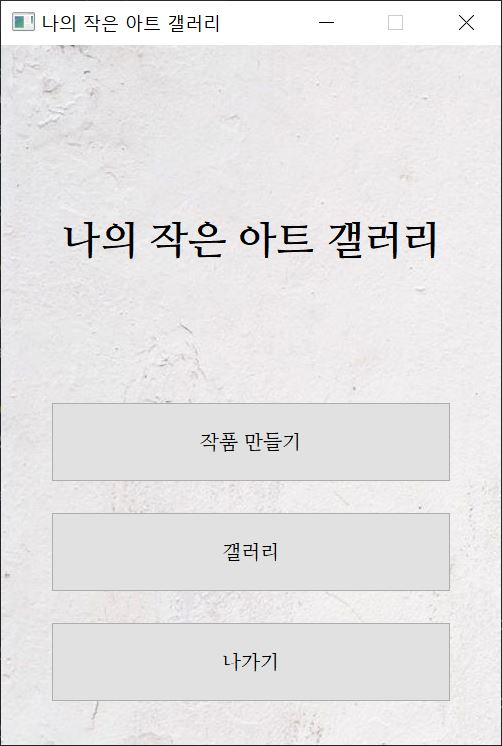

   - 새로운 작품을 갤러리 컬렉션에 추가하고 싶다면 `**작품 만들기**` 버튼을 선택해주세요.

   - 소장 중인 작품을 감상하고 싶다면 `**갤러리**` 버튼을 선택해주세요.

   - 오늘 갤러리의 운영을 마치고 싶으시다면 `**나가기**` 버튼을 선택해주세요.

2. **작품 만들기 페이지 (MyArtistPage)**

   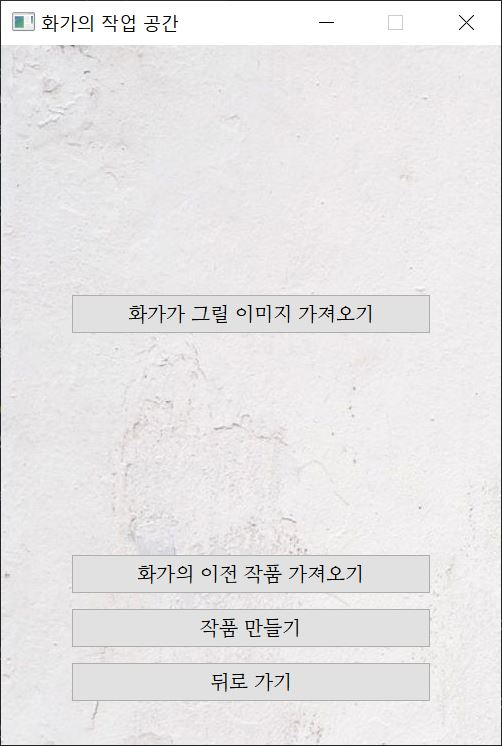
   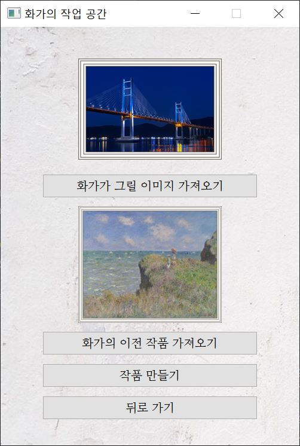
   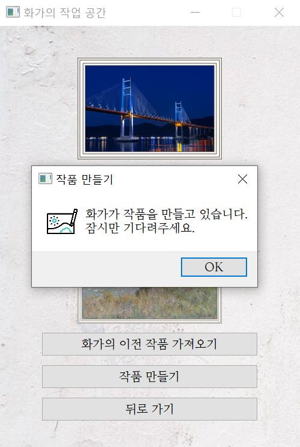

   - `**화가가 그릴 이미지 가져오기**` 버튼을 통해 변환을 원하는 이미지를 가져와주세요.

   - `**화가의 이전 작품 가져오기**` 버튼을 통해 원하는 스타일의 작품을 선택해주세요. 선택된 작품의 화풍에 따라 만들어지는 작품의 스타일이 달라집니다.

   - 이미지를 모두 선택했다면 `**작품 만들기**` 버튼을 통해 화가에게 작품을 의뢰해주세요. 화가가 작품을 완성할 때까지 잠시 기다려주세요.

3. **작품 만들기 결과 페이지 (MyArtistResult)**

   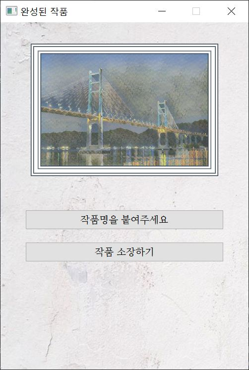
   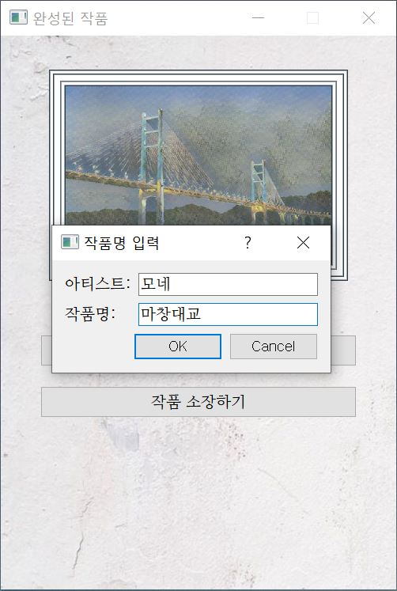
    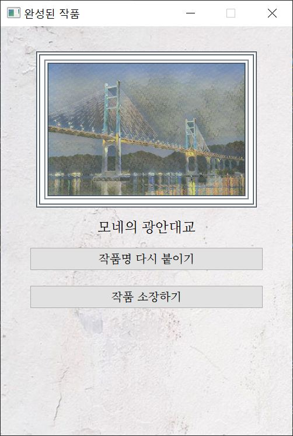

   - `**작품명을 붙여주세요**` 버튼을 통해 작품에 고유한 이름을 부여해주세요.

   - `**작품명 다시 붙이기*`\* 버튼을 통해 이름을 변경할 수 있습니다.

   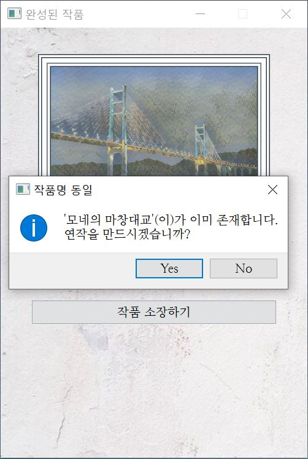
   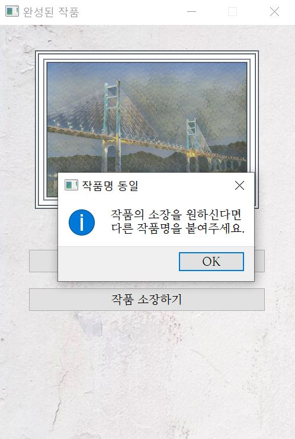

   - `**작품 소장**` 버튼을 통해 새로운 작품을 갤러리 컬렉션에 추가할 수 있습니다.

   **_한번 소장한 작품의 이름은 다시 변경할 수 없으니 주의해주세요!_**

4. **갤러리 페이지 (GalleryPage)**

   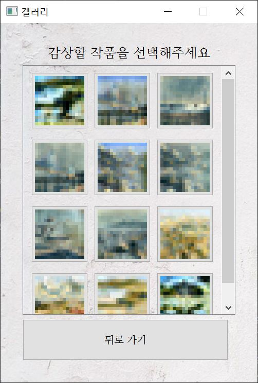

   - 갤러리 페이지에는 소장한 작품이 비트맵 아이콘으로 나타납니다.
   - `**감상을 원하는 작품의 비트맵 아이콘**`을 선택하면 전시된 작품을 감상할 수 있습니다.

5. **작품 전시 페이지 (ArtworkPage)**

   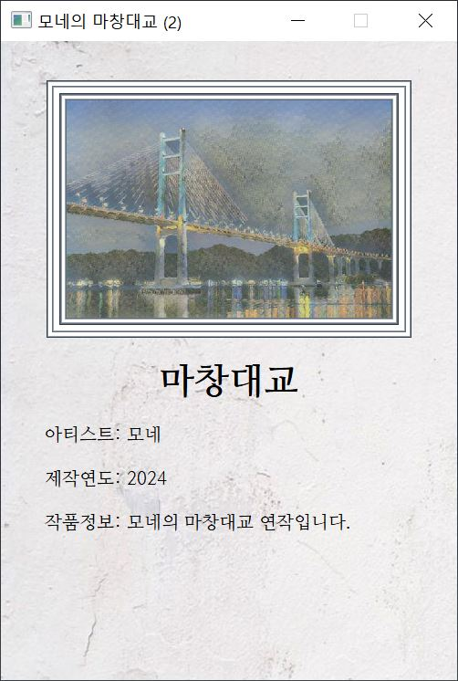

   - 전시된 작품을 감상할 수 있습니다.
   - 액자의 하단에는 작품의 상세 정보인 작품명, 아티스트명, 제작연도가 표시됩니다. 같은 작품명을 가진 연작들은 연작 정보 또한 표시됩니다.
